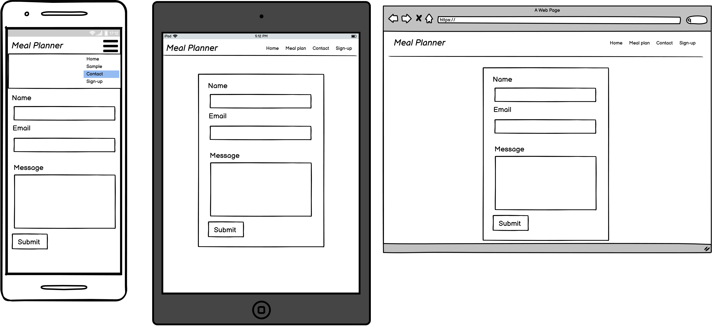

# Meal Planner
(Developer: Ana Runje)

Disclaimer: Due to time constraints, this app is still in a very rudimentary form and full of bugs. Sorry!
I still decided to submit it in the spirit of better to submit something then nothing at all.

[Live webpage](https://ci-pp4-meal-planner.herokuapp.com/)

## Table of Content

1. [Project Goals](#project-goals)
    1. [User Goals](#user-goals)
    2. [Site Owner Goals](#site-owner-goals)
2. [User Experience](#user-experience)
    1. [Target Audience](#target-audience)
    2. [User Requirements and Expectations](#user-requirements-and-expectations)
    3. [User Stories](#user-stories)
    4. [Site Owner Stories](#site-owner-stories)
3. [Design](#design)
    1. [Design Choices](#design-choices)
    2. [Colour](#colours)
    3. [Fonts](#fonts)
    4. [Structure](#structure)
    5. [Wireframes](#wireframes)
4. [Technologies Used](#technologies-used)
    1. [Languages](#languages)
    2. [Frameworks & Tools](#frameworks-&-tools)
5. [Features](#features)
6. [Testing](#validation)
    1. [HTML Validation](#HTML-validation)
    2. [CSS Validation](#CSS-validation)
    3. [JavaScript Validation](#javascript-validation)
    4. [Accessibility](#accessibility)
    5. [Performance](#performance)
    6. [Device testing](#performing-tests-on-various-devices)
    7. [Browser compatibility](#browser-compatability)
    8. [Testing user stories](#testing-user-stories)
8. [Bugs](#Bugs)
9. [Deployment](#deployment)
10. [Credits](#credits)
11. [Acknowledgments](#acknowledgments)

## Project Goals 
Meal Planner is a web app for weekly meal planning. A user is required to sign up in order to create, view or edit their meal plans. 

### User Goals
- Planning meals for the week
- Saving/having multiple meal plans

### Site Owner Goals
- Providing a platform for users to create and view meal plans

## User Experience

### Target Audience
- people who meal plan on a weekly basis
- people who would like to eliminate the question what do we do for dinner tonight
- people with special diatary requierments who need to plan ahead
- people who like to be organized

### User Requirements and Expectations
- A simple and intuitive navigation system
- Quick and easy to use
- Links and functions that work as expected
- Good presentation and a visually appealing design regardless of screen size
- An easy way to leave feedback
- Accessibility

### User Stories
1. As a Site User, I can register an account so that I can create a meal plan
2. As a Site User, I can edit my meal plan so that I can change my plan later
3. As a Site User, I can create multiple meal plans so that I can plan further ahead
4. As a First Time User, I can see a sample meal plan so that I can see what the app is all about
5. As a Site Owner I can receive the users' feedback and comments as emails so that I know a contact form was filled in real time
6. As a Site User I can fill out a contact form so that I can leave comments, suggestions, questions or feedback about the app
7. As a Site User I can see a confirmation message so that I know that my form was submitted successfuly
8. As a Site User I can use the navigation bar so that I can easily navigate to different pages
9. As a Site User I can navigate between meal plans so that I can choose which meal plan to read
10. As a Site User I can delete a meal plane so that I can remove it when no longer needed
11. As a New user I can view the landing page so that I can learn the sites purpose
12. As a Site Owner I want calls to action on the landing page so that site users can easily sign up for the service
13. As a Site User I can pick the start date of my meal plan so that I can plan my weekly meals on the most convenient day of the week
14. As a Site owner I want to make sure, only the logged-in user can view meal plans so that data privacy is ensured

## Design

### Design Choices

### Colour

### Fonts

### Structure
The page is structured in a user-friendly and easy-to-learn way. Upon arriving at the website the user sees the home page, where the purpose of the site is explained. The website consists of 4 separate pages:
1. Home page
2. Sample meal plan
3. Meal planning (only visible to the logged in user)
4. Contact form

### Wireframes

Home

Meal Plan

Contact Form

## Technologies Used

### Languages
- HTML
- CSS
- JavaScript
- Python

### Frameworks & Tools
- Django
- PostgreSQL
- Bootstrap v5.0
- Git
- GitHub
- Gitpod
- Tinypng
- Paint.NET
- Balsamiq
- Font Awesome
- Favicon.io
- JSHint
- Lighthouse
- W3C Markup validation service
- W3C Jigsaw CSS validation service 
- WAVE WebAIM web accessibility evaluation tool
- EmailJS

## Features
The site consists of 4 pages and ... features

### Feature
1. Navigation bar
- 
- user storie covered: 

2. Hero image
3. About section
4. Sign-up button
5. Sample meal plan
6. Adding meal plan
7. Viewing meal plan
8. Editing meal plan
9. Deleting meal plan
10. Contact Form

## Validation

### HTML Validation
The W3C Markup Validation Service was used to validate the HTML of the website. All pages pass with no errors no warnings to show.

### CSS Validation
The W3C Jigsaw CSS Validation Service was used to validate the CSS of the website. When validating the page as a whole, the validator shows some errors linked to Bootstrap v5.0. When validating just my custom CSS it passes with no errors.

Full page

### JavaScript Validation
JSHint Static Code Analysis Tool for JavaScript was used to validate the Javascript files. No significant issues were found.

### Accessibility
The WAVE WebAIM web accessibility evaluation tool was used to ensure the website met high accessibility standards. All pages pass with 0 errors.

### Performance 
Google Lighthouse in Google Chrome Developer Tools was used to test the performance of the website.

### Performing tests on various devices 
The website was tested on the following devices:

- Lenovo Yoga 2 Pro (both in pc and tablet mode)
- Honor 20 pro
- Xiaomi Redmi Note 7

In addition, the website was tested using the Google Chrome Developer Tools Device Toggling option for all available device options.

### Browser Compatability
The website was tested on the following browsers:

- Google Chrome
- Mozilla Firefox
- Microsoft Edge

### Testing user stories

1. As a user, I want to ... so I can ...

| **Feature** | **Action** | **Expected Result** | **Actual Result** |
|-------------|------------|---------------------|-------------------|

## Bugs

| **Bug** | **Fix** |
| ----------- | ----------- |

## Deployment
The website was deployed using Heroku by "following these steps:
1. Use the "pip freeze -> requiremnts.txt" command in the terminal to save any libraries that need to be instaled in the file
2. Login or create a Heroku account
3. Click the "new" button in the upper right corner and select "create new app"
4. Choose an app name and your region and click "Create app"
5. Go to the "settings" tab, add the python build pack and then the node.js build pack
6. Go to the "deploy" tab and pick GitHub as a deployment method
7. Search for a repository to connect to
8. Click enable automatic deploys and then deploy branch
9. Wait for the app to build and then click on the "View" link

You can fork the repository by following these steps:
1. Go to the GitHub repository
2. Click on the Fork button in the upper right-hand corner

You can clone the repository by following these steps:
1. Go to the GitHub repository
2. Locate the Code button above the list of files and click it
3. Select if you prefer to clone using HTTPS, SSH, or Github CLI and click the copy button to copy the URL to your clipboard
4. Open Git Bash
5. Change the current working directory to the one where you want the cloned directory
6. Type git clone and paste the URL from the clipboard ($ git clone https://github.com/YOUR-USERNAME/YOUR-REPOSITORY)
7. Press Enter to create your local clone.

## Credits

### Media
- background image: <a href='https://www.freepik.com/psd/food'>Food psd created by freepik - www.freepik.com</a>

### Code

## Acknowledgments
I would like to take the opportunity to thank:
- My mentor Mo Shami for his feedback, advice, guidance and support.
- My husband Jure Runje for his support, advice, help with testing, and for giving me some kids free time to work on my project.
