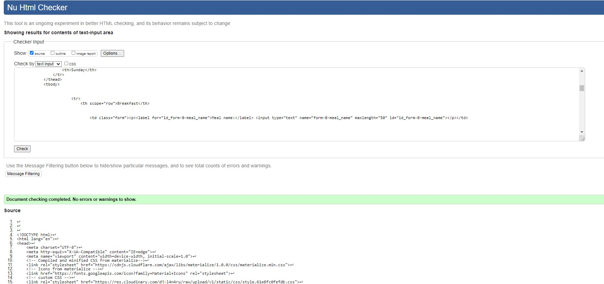

# Meal Planner
(Developer: Ana Runje)

[Live webpage](https://ci-pp4-meal-planner.herokuapp.com/)

## Table of Content

1. [Project Goals](#project-goals)
    1. [User Goals](#user-goals)
    2. [Site Owner Goals](#site-owner-goals)
2. [User Experience](#user-experience)
    1. [Target Audience](#target-audience)
    2. [User Requirements and Expectations](#user-requirements-and-expectations)
    3. [User Stories](#user-stories)
    4. [Site Owner Stories](#site-owner-stories)
3. [Design](#design)
    1. [Design Choices](#design-choices)
    2. [Colour](#colours)
    3. [Fonts](#fonts)
    4. [Structure](#structure)
    5. [Wireframes](#wireframes)
4. [Technologies Used](#technologies-used)
    1. [Languages](#languages)
    2. [Frameworks](#frameworks)
    3. [Database](#database)
    4. [Tools](#tools)
5. [Features](#features)
6. [Testing](#validation)
    1. [HTML Validation](#HTML-validation)
    2. [CSS Validation](#CSS-validation)
    3. [JavaScript Validation](#javascript-validation)
    4. [Accessibility](#accessibility)
    5. [Performance](#performance)
    6. [Device testing](#performing-tests-on-various-devices)
    7. [Browser compatibility](#browser-compatability)
    8. [Testing user stories](#testing-user-stories)
8. [Bugs](#Bugs)
9. [Deployment](#deployment)
10. [Credits](#credits)
11. [Acknowledgments](#acknowledgments)

## Project Goals 
Meal Planner is a web app for weekly meal planning. A user is required to sign up in order to create, view or edit their meal plans. 

### User Goals
- Planning meals for the week
- Saving/having multiple meal plans

### Site Owner Goals
- Providing a platform for users to create and view meal plans

## User Experience

### Target Audience
- people who meal plan on a weekly basis
- people who would like to eliminate the question what do we do for dinner tonight
- people with special diatary requierments who need to plan ahead
- people who like to be organized

### User Requirements and Expectations
- A simple and intuitive navigation system
- Quick and easy to use
- Links and functions that work as expected
- Good presentation and a visually appealing design regardless of screen size
- Options to add, view, edit and delete meal plans
- Accessibility

### User Stories
1. As a Site User, I can register an account so that I can create a meal plan
2. As a Site User, I can edit my meal plan so that I can change my plan later
3. As a Site User, I can create multiple meal plans so that I can plan further ahead
4. As a First Time User, I can see a sample meal plan so that I can see what the app is all about
5. As a Site User I can see a confirmation message so that I know that my form was submitted successfuly
6. As a Site User I can use the navigation bar so that I can easily navigate to different pages
7. As a Site User I can navigate between meal plans so that I can choose which meal plan to read
8. As a Site User I can delete a meal plan so that I can remove it when no longer needed
9. As a New user I can view the landing page so that I can learn the sites purpose
10. As a Site Owner I want calls to action on the landing page so that site users can easily sign up for the service
11. As a Site User I can pick the start date of my meal plan so that I can plan my weekly meals on the most convenient day of the week
12. As a Site owner I want to make sure, only the logged-in user can view meal plans so that data privacy is ensured

## Design

### Design Choices
The webpage was designed to be simple, clean and modern looking.

### Colour
For the colours in the webpage I used default Materialize colours that suited the the background image very well and created a nice and cohesive look, whilst maintaining accessibility and providing sufficient contrast between foreground and background elements.

Colour Pallete

### Fonts

### Structure
The page is structured in a user-friendly and easy-to-learn way. Upon arriving at the website the user sees the home page, where the purpose of the site is explained. The website consists of 10 separate pages:
1. Home page
2. Add meal plan page
3. Edit meal plan page
4. Meal plans page
5. Pick start date page
6. Sample meal plan
7. Login page
8. Logout page
9. Signup page
10. 404 page

### Wireframes

Home

Meal Plan

## Technologies Used

### Languages
- HTML
- CSS
- JavaScript
- Python

### Frameworks
- Django 3.2.8
- Django supporting libraries:
    - allauth for authentication, registration, login and logout functionality
    - gunicorn as the server for Heroku
    - psycopg2as an adaptor for Python and PostgreSQL databases
    - dj-database to parse the database URL from the environment variables in Heroku
- Materialize as a responsive front-end framework

### Database
- Heroku Postgres

### Tools
- Git
- GitHub
- Gitpod
- Balsamiq
- Favicon.io to create the favicon
- JSHint
- Lighthouse
- W3C Markup validation service
- W3C Jigsaw CSS validation service 
- WAVE WebAIM web accessibility evaluation tool
- PEP8 online to validate Python code
- Coolors to generate the colour palette
- Techsini Multi Device Website Mockup Generator
- Heroku Cloud Application Platform
- Cloudinary 
- Photopea advanced image editor 

## Features
The site consists of 10 pages and ... features

### Feature
1. Navigation bar
- 
- user storie covered: 

2. Call to action
3. Viewing meal plan
4. Meal plan actions - tooltips
5. Pagination
6. Date picker
7. Confirm delete modal
8. Sign-up form
9. Login form
10. Logout confirmation
11. User action messages
12. 404 page
13. Sample meal plan
14. Adding meal plan
15. Editing meal plan
16. Deleting meal plan

## Validation

### HTML Validation
The W3C Markup Validation Service was used to validate the HTML of the website. All pages pass with no errors no warnings to show.

Index page when user logged in

Index page when user logged lout

Pick start date page

Add meals

Edit meal plan

My meal plans

Login page

Logout page

Signup page

404 page

### CSS Validation
The W3C Jigsaw CSS Validation Service was used to validate the CSS of the website. When validating the page as a whole, the validator shows some errors linked to Materialize. When validating just my custom CSS it passes with no errors.

Custom CSS

### JavaScript Validation
JSHint Static Code Analysis Tool for JavaScript was used to validate the Javascript files. No significant issues were found.

script.js

### Accessibility
The WAVE WebAIM web accessibility evaluation tool was used to ensure the website met high accessibility standards. I was only able to test pages whit the unauthenticated user. All these tests pass with 0 errors.

Home page

Login page

Signup page

Sample mealplan

### Performance 
Google Lighthouse in Google Chrome Developer Tools was used to test the performance of the website.

### Performing tests on various devices 
The website was tested on the following devices:

- Lenovo Yoga 2 Pro (both in pc and tablet mode)
- Honor 20 pro
- Xiaomi Redmi Note 7
- Samsung Galaxy A52s 5G

In addition, the website was tested using the Google Chrome Developer Tools Device Toggling option for all available device options.

### Browser Compatability
The website was tested on the following browsers:

- Google Chrome
- Mozilla Firefox
- Microsoft Edge

### Testing user stories

1. As a user, I want to ... so I can ...

| **Feature** | **Action** | **Expected Result** | **Actual Result** |
|-------------|------------|---------------------|-------------------|

## Bugs

| **Bug** | **Fix** |
| ----------- | ----------- |

## Deployment
The app was deployed on Heroku by following these steps:
### Heroku
1. Create your Heroku app
- Navigate to the Heroku website
- In the Heroku browser window, create an account by entering your email address and a password
- Activate the account through the authentication email sent to your email account
- Click the new button and select create a new app from the dropdown menu
- Enter a name for the application which must be unique
- Select the region closest to you
- Click create app
2. Create the Database
- In the Heroku dashboard click on the Resources tab
- Scroll down to Add-Ons, search for and select 'Heroku Postgres'
3. Set up Environment Variables
- In the Heroku Settings tab, scroll down to 'Reveal Config Vars' and transfer you environment variables here
4. Set up Cloudinary for static and media files storage
- Create a Cloudinary account and from the 'Dashboard' in Cloudinary copy your url into the 'Config Vars' in Heroku
    - for key type: CLOUDINARY_URL
    - for value paste in your cloudinar url
5. Add Heroku Hostname to ALLOWED_HOSTS: ALLOWED_HOSTS = ['favoureats.herokuapp.com', 'localhost'] in your settings.py
6. Create Procfile in top level directory:
    - In Procfile add: web: gunicorn app_name .wsgi
7. Heroku Deployment:
- Click Deploy tab in Heroku
- In the 'Deployment method' section select 'Github' and click the 'connect to Github' button to confirm.
- In the 'search' box enter the Github repository name for the project
- Click search and then click connect to link the heroku app with the Github repository. The box will confirm that heroku is connected to the repository.
8. Final Deployment
- When development is complete change the debug setting to: DEBUG = False in settings.py
- To manually deploy click the button 'Deploy Branch'. The default 'main' option in the dropdown menu should be selected in both cases. When the app is deployed a message 'Your app was successfully deployed' will be shown. Click 'view' to see the deployed app in the browser. The live deployment of the project can be seen here

### Forking the Repository
- To fork the project navigate to the repository on GitHub
- Click on the Fork button in the upper right-hand corner

### Cloning the Repository
- To clone the project navigate to the repository on GitHub
- Above the list of files click the dropdown code menu.
- Select if you prefer to clone using HTTPS, SSH, or Github CLI and click the copy button to copy the URL to your clipboard
- Open Git Bash
- Change the current working directory to the one where you want the cloned directory
- Type git clone and paste the URL from the clipboard ($ git clone https://github.com/YOUR-USERNAME/YOUR-REPOSITORY)
- Press Enter to create your local clone.

## Credits
### Media
- background image: <a href='https://www.freepik.com/psd/food'>Food psd created by freepik - www.freepik.com</a>

### Code
-  code for prepopulating the formsets when editing meal plans was inspired by this https://stackoverflow.com/a/15853036

## Acknowledgments
I would like to take the opportunity to thank:
- My mentor Mo Shami for his feedback, advice, guidance and support.
- My husband Jure Runje for his support, advice, help with testing, and for giving me some kids free time to work on my project.
